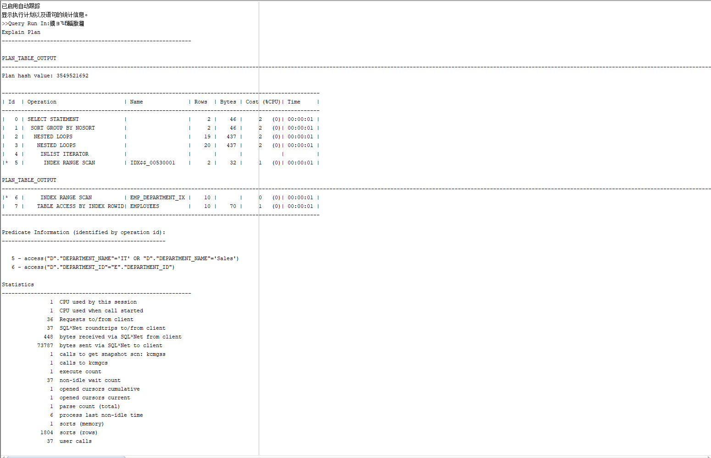
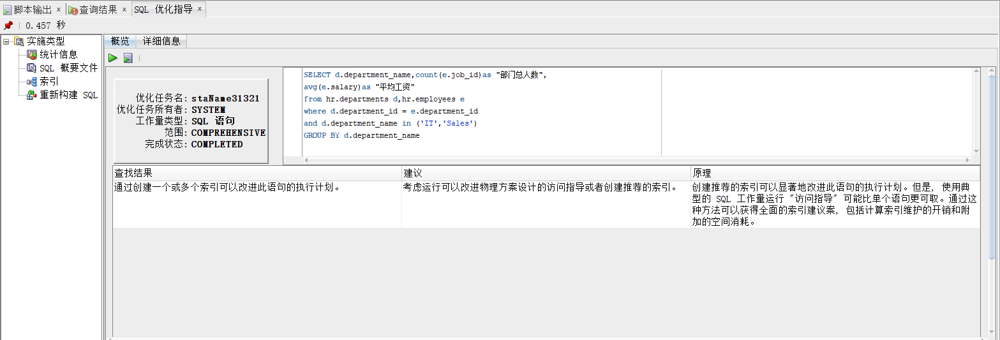
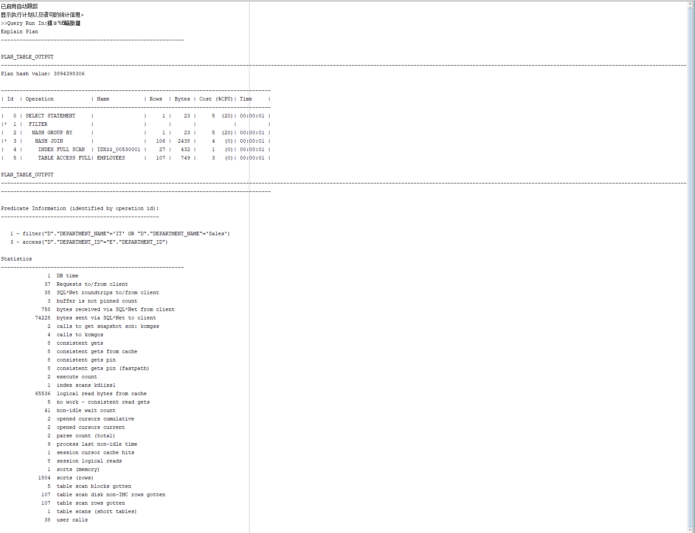
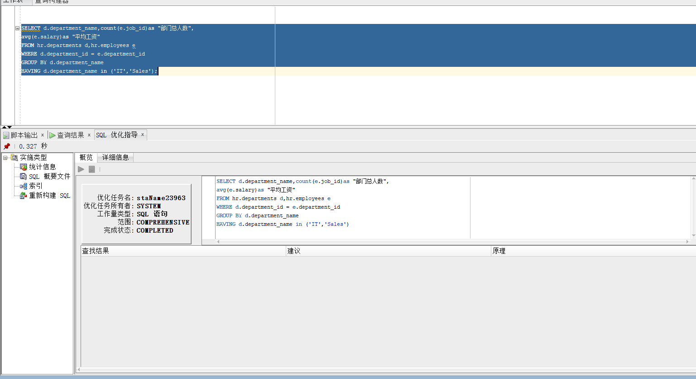
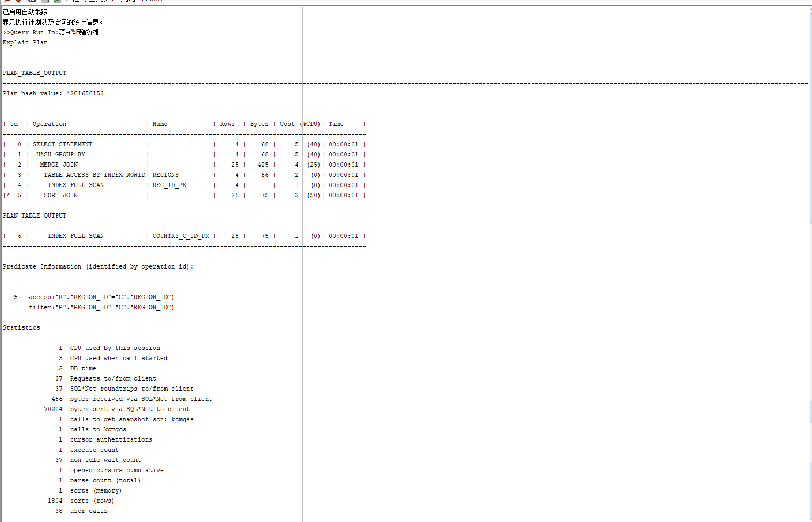
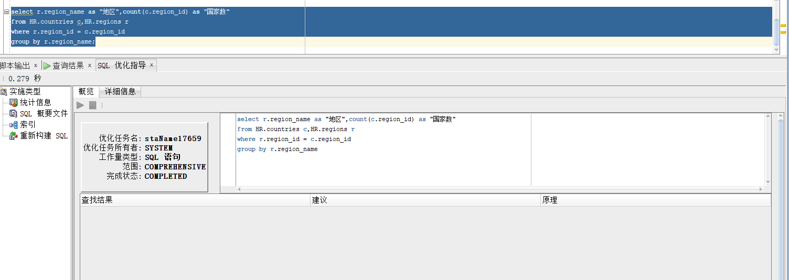

#作业1：SQL语句的执行计划分析与优化指导
##刘勇  软件18-3  学号：201810414316
###实验目的
    分析SQL执行计划，执行SQL语句的优化指导。理解分析SQL语句的执行计划的重要作用。
###实验内容
    对Oracle12c中的HR人力资源管理系统中的表进行查询与分析。
    首先运行和分析教材中的样例：本训练任务目的是查询两个部门('IT'和'Sales')的部门总人数和平均工资，以下两个查询的结果是一样的。但效率不相同。
    设计自己的查询语句，并作相应的分析，查询语句不能太简单。
###查询语句1：

set autotrace on

SELECT d.department_name,count(e.job_id)as "部门总人数",
avg(e.salary)as "平均工资"
from hr.departments d,hr.employees e
where d.department_id = e.department_id
and d.department_name in ('IT','Sales')
GROUP BY d.department_name;
###实验结果1：
####执行计划结果：

#####优化指导结果：

###查询语句2：

set autotrace on

SELECT d.department_name,count(e.job_id)as "部门总人数",
avg(e.salary)as "平均工资"
FROM hr.departments d,hr.employees e
WHERE d.department_id = e.department_id
GROUP BY d.department_name
HAVING d.department_name in ('IT','Sales');
###实验结果2：
####执行计划结果：

#####优化指导结果：

###查询语句3：
查询HR人力资源表，统计职工所在不同地区的国家数量
select r.region_name as "地区",count(c.region_id) as "国家数"
from HR.countries c,HR.regions r
where r.region_id = c.region_id 
group by r.region_name;

###实验结果3：
####执行计划结果：

#####优化指导结果：
