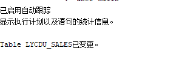

#作业3：In_Memory
##刘勇  软件18-3  学号：201810414316
###实验步骤：

####第1步：创建表lycdu_sales，插入100万条记录
CREATE TABLE lycdu_sales
   (ID NUMBER primary key, 
	NAME VARCHAR2(50 BYTE) not null, 
	QUANTITY NUMBER(8,0), 
	PRICE NUMBER(8,0)
);

--插入100万行数据
declare 
v1 number;
v2 number;
begin
    delete from lycdu_sales;
    for i in 1..1000000
    loop
        v1:=dbms_random.value(1,90);
        v2:=dbms_random.value(100,900);
        insert into lycdu_sales(id,name,quantity,price) values (i,'name'||i,v1,v2);
    end loop;
    commit;
end;

####结果：

####第2步：--进行IN-Memory前后的查询对比
--in-memory前：
--两次执行:
set autotrace on TRACEONLY 
select sum(quantity*price) total from lycdu_sales;
####结果：

--in-memory：
set autotrace on
alter table lycdu_sales inmemory;
####结果：

--in-memory后：
--两次执行:
select sum(quantity*price) total from lycdu_sales;
####结果：

