# 实验6(期末考核)：基于Oracle的图书售卖系统数据库设计

## 刘勇  软件18-3  学号：201810414316

### 期末考核要求

自行设计一个信息系统的数据库项目，自拟系统名称。
设计项目涉及的表及表空间使用方案。至少5张表和5万条数据，两个表空间。
设计权限及用户分配方案。至少两类角色，两个用户。
在数据库中建立一个程序包，在包中用PL/SQL语言设计一些存储过程和函数，实现比较复杂的业务逻辑，用模拟数据进行执行计划分析。
设计自动备份方案或则手工备份方案。

### 系统场景

有一个售卖图书的交易系统，需要对图书、买卖双方进行管理。涉及到的表有：管理员表、用户表、商品表、购物车表、评论表。

### 数据库设计

#### 管理员表(adminstrator)

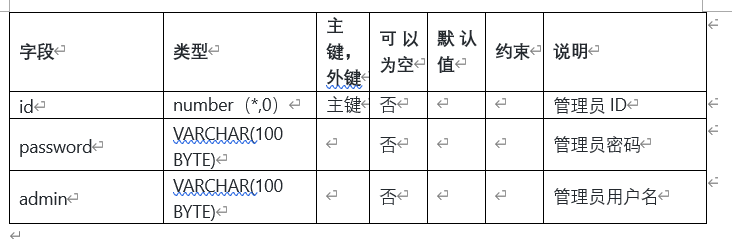

#### 用户表(bookuser)

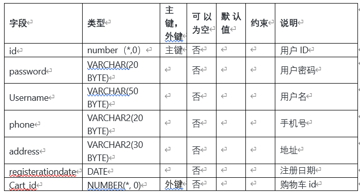

#### 商品表(commodity)

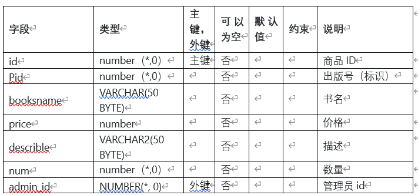

#### 购物车表(cart)

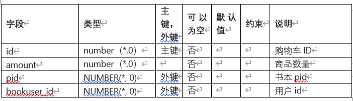

#### 评论表(forum)


### 实验步骤

#### 1.创建表空间

space_ly001

``` oracle
Create Tablespace space_ly001
datafile
'/home/oracle/app/oracle/oradata/orcl/pdborcl/pdbtest_ly001_1.dbf'
  SIZE 100M AUTOEXTEND ON NEXT 256M MAXSIZE UNLIMITED,
'/home/oracle/app/oracle/oradata/orcl/pdborcl/pdbtest_ly001_2.dbf'
  SIZE 100M AUTOEXTEND ON NEXT 256M MAXSIZE UNLIMITED
EXTENT MANAGEMENT LOCAL SEGMENT SPACE MANAGEMENT AUTO;
```

space_ly002

``` oracle
Create Tablespace space_ly002
datafile
'/home/oracle/app/oracle/oradata/orcl/pdborcl/pdbtest_ly002_1.dbf'
  SIZE 100M AUTOEXTEND ON NEXT 256M MAXSIZE UNLIMITED,
'/home/oracle/app/oracle/oradata/orcl/pdborcl/pdbtest_ly002_2.dbf'
  SIZE 100M AUTOEXTEND ON NEXT 256M MAXSIZE UNLIMITED
EXTENT MANAGEMENT LOCAL SEGMENT SPACE MANAGEMENT AUTO;
```

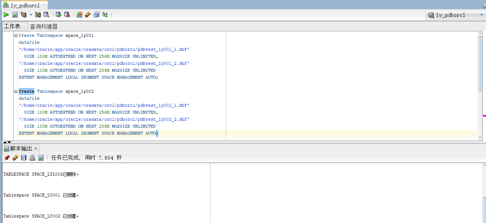

#### 2.创建角色及用户

用户默认使用表空间space_ly001
--创建角色ly1及用户ly_1:

``` oracle
  CREATE ROLE ly1;
  GRANT connect,resource,CREATE VIEW TO ly1;
  CREATE USER ly_1 IDENTIFIED BY 123 DEFAULT TABLESPACE space_ly001 TEMPORARY TABLESPACE temp;
  ALTER USER ly_1 QUOTA 60M ON space_ly001;
  GRANT ly1 TO ly_1;
```

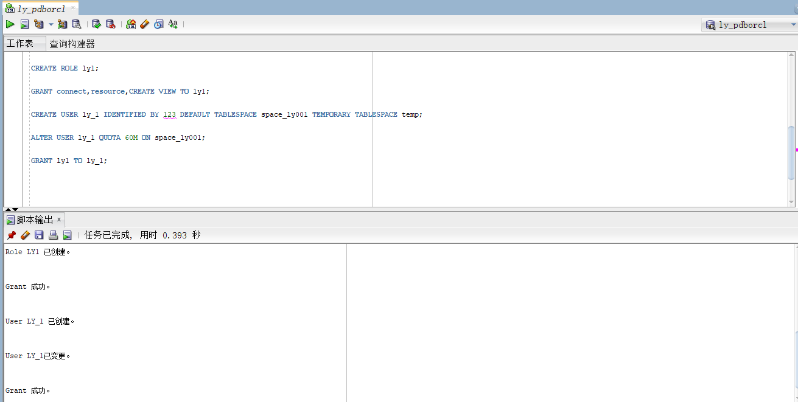

--创建角色ly2及用户ly_2

``` oracle
  CREATE ROLE ly2;
  GRANT connect,resource TO ly2;
  CREATE USER ly_2 IDENTIFIED BY 123 DEFAULT TABLESPACE space_ly001 TEMPORARY TABLESPACE temp;
  ALTER USER ly_2 QUOTA 60M ON space_ly001;
  GRANT ly2 TO ly_2;
  ```

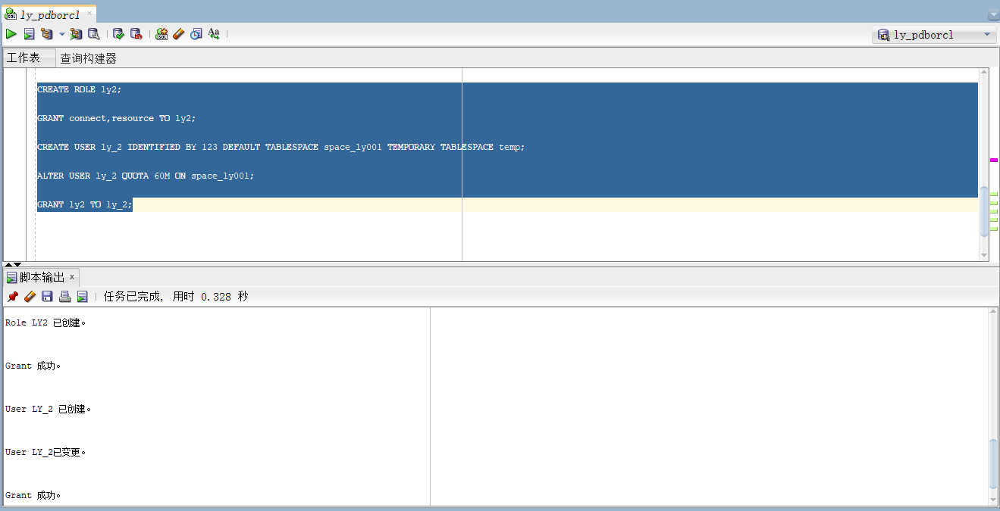

#### 3.创建表

##### 管理员表

``` oracle
CREATE TABLE ADMINISTRATOR 
(
  ID NUMBER(*, 0) NOT NULL 
, PASSWORD VARCHAR2(20 BYTE) NOT NULL 
, ADMIN VARCHAR2(20 BYTE) NOT NULL 
, CONSTRAINT ADMINISTRATOR_PK PRIMARY KEY 
  (
    ID 
  )
  USING INDEX 
  (
      CREATE UNIQUE INDEX ADMINISTRATOR_PK ON ADMINISTRATOR (ID ASC) 
      LOGGING 
      TABLESPACE SPACE_LY001 
      PCTFREE 10 
      INITRANS 2 
      STORAGE 
      ( 
        BUFFER_POOL DEFAULT 
      ) 
      NOPARALLEL 
  )
  ENABLE 
) 
LOGGING 
TABLESPACE SPACE_LY001 
PCTFREE 10 
INITRANS 1 
STORAGE 
( 
  BUFFER_POOL DEFAULT 
) 
NOCOMPRESS 
NO INMEMORY 
NOPARALLEL;
```

##### 用户表

``` oracle
CREATE TABLE BOOKUSER 
(
  ID NUMBER(*, 0) NOT NULL 
, PASSWORD VARCHAR2(20 BYTE) NOT NULL 
, USERNAME VARCHAR2(50 BYTE) NOT NULL 
, PHONE VARCHAR2(20 BYTE) NOT NULL 
, ADDRESS VARCHAR2(30 BYTE) NOT NULL 
, REGISTRATIONDATE DATE NOT NULL 
, CART_ID NUMBER(*, 0) NOT NULL 
, CONSTRAINT U_PK PRIMARY KEY 
  (
    ID 
  )
  USING INDEX 
  (
      CREATE UNIQUE INDEX U_PK ON BOOKUSER (ID ASC) 
      LOGGING 
      TABLESPACE SPACE_LY001 
      PCTFREE 10 
      INITRANS 2 
      STORAGE 
      ( 
        BUFFER_POOL DEFAULT 
      ) 
      NOPARALLEL 
  )
  ENABLE 
) 
TABLESPACE SPACE_LY001 
PCTFREE 10 
INITRANS 1 
STORAGE 
( 
  BUFFER_POOL DEFAULT 
) 
NOCOMPRESS 
NOPARALLEL 
PARTITION BY RANGE (REGISTRATIONDATE) 
SUBPARTITION BY RANGE (REGISTRATIONDATE) 
(
  PARTITION DATE2018 VALUES LESS THAN (TO_DATE(' 2018-12-31 00:00:00', 'SYYYY-MM-DD HH24:MI:SS', 'NLS_CALENDAR=GREGORIAN')) 
  TABLESPACE SPACE_LY001 
  PCTFREE 10 
  INITRANS 1 
  STORAGE 
  ( 
    BUFFER_POOL DEFAULT 
  ) 
  NOCOMPRESS NO INMEMORY 
  (
    SUBPARTITION DATE2018_3 VALUES LESS THAN (TO_DATE(' 2018-03-31 00:00:00', 'SYYYY-MM-DD HH24:MI:SS', 'NLS_CALENDAR=GREGORIAN')) 
    NOCOMPRESS NO INMEMORY  
  , SUBPARTITION DATE2018_6 VALUES LESS THAN (TO_DATE(' 2018-06-30 00:00:00', 'SYYYY-MM-DD HH24:MI:SS', 'NLS_CALENDAR=GREGORIAN')) 
    NOCOMPRESS NO INMEMORY  
  , SUBPARTITION DATE2018_9 VALUES LESS THAN (TO_DATE(' 2018-09-30 00:00:00', 'SYYYY-MM-DD HH24:MI:SS', 'NLS_CALENDAR=GREGORIAN')) 
    NOCOMPRESS NO INMEMORY  
  , SUBPARTITION DATE2018_12 VALUES LESS THAN (TO_DATE(' 2018-12-31 00:00:00', 'SYYYY-MM-DD HH24:MI:SS', 'NLS_CALENDAR=GREGORIAN')) 
    NOCOMPRESS NO INMEMORY  
  )  
, PARTITION DATE2019 VALUES LESS THAN (TO_DATE(' 2019-12-31 00:00:00', 'SYYYY-MM-DD HH24:MI:SS', 'NLS_CALENDAR=GREGORIAN')) 
  TABLESPACE SPACE_LY001 
  PCTFREE 10 
  INITRANS 1 
  STORAGE 
  ( 
    BUFFER_POOL DEFAULT 
  ) 
  NOCOMPRESS NO INMEMORY 
  (
    SUBPARTITION DATE2019_3 VALUES LESS THAN (TO_DATE(' 2019-03-31 00:00:00', 'SYYYY-MM-DD HH24:MI:SS', 'NLS_CALENDAR=GREGORIAN')) 
    NOCOMPRESS NO INMEMORY  
  , SUBPARTITION DATE2019_6 VALUES LESS THAN (TO_DATE(' 2019-06-30 00:00:00', 'SYYYY-MM-DD HH24:MI:SS', 'NLS_CALENDAR=GREGORIAN')) 
    NOCOMPRESS NO INMEMORY  
  , SUBPARTITION DATE2019_9 VALUES LESS THAN (TO_DATE(' 2019-09-30 00:00:00', 'SYYYY-MM-DD HH24:MI:SS', 'NLS_CALENDAR=GREGORIAN')) 
    NOCOMPRESS NO INMEMORY  
  , SUBPARTITION DATE2019_12 VALUES LESS THAN (TO_DATE(' 2019-12-31 00:00:00', 'SYYYY-MM-DD HH24:MI:SS', 'NLS_CALENDAR=GREGORIAN')) 
    NOCOMPRESS NO INMEMORY  
  )  
);

```

##### 商品表

``` oracle

CREATE TABLE COMMODITY 
(
  ID NUMBER(*, 0) NOT NULL 
, PID NUMBER(*, 0) NOT NULL 
, BOOKSNAME VARCHAR2(50 BYTE) NOT NULL 
, PRICE NUMBER NOT NULL 
, DESCRIBE VARCHAR2(50 BYTE) NOT NULL 
, NUM NUMBER(*, 0) NOT NULL 
, ADMIN_ID NUMBER(*, 0) NOT NULL 
, CONSTRAINT COMMODITY_PK PRIMARY KEY 
  (
    ID 
  )
  USING INDEX 
  (
      CREATE UNIQUE INDEX COMMODITY_PK ON COMMODITY (ID ASC) 
      LOGGING 
      TABLESPACE SPACE_LY001 
      PCTFREE 10 
      INITRANS 2 
      STORAGE 
      ( 
        BUFFER_POOL DEFAULT 
      ) 
      NOPARALLEL 
  )
  ENABLE 
) 
LOGGING 
TABLESPACE SPACE_LY001 
PCTFREE 10 
INITRANS 1 
STORAGE 
( 
  BUFFER_POOL DEFAULT 
) 
NOCOMPRESS 
NO INMEMORY 
NOPARALLEL;

```

##### 购物车表

``` oracle
CREATE TABLE CART 
(
  ID NUMBER(*, 0) NOT NULL 
, AMOUNT NUMBER(*, 0) NOT NULL 
, PID NUMBER(*, 0) NOT NULL 
, BOOKUSER_ID NUMBER(*, 0) NOT NULL 
, CONSTRAINT CART_PK PRIMARY KEY 
  (
    ID 
  )
  USING INDEX 
  (
      CREATE UNIQUE INDEX CART_PK ON CART (ID ASC) 
      LOGGING 
      TABLESPACE SPACE_LY001 
      PCTFREE 10 
      INITRANS 2 
      STORAGE 
      ( 
        BUFFER_POOL DEFAULT 
      ) 
      NOPARALLEL 
  )
  ENABLE 
, CONSTRAINT CART_BOOKUSER FOREIGN KEY
  (
  BOOKUSER_ID 
  )
  REFERENCES BOOKUSER
  (
  ID 
  )
  ENABLE 
) 
PCTFREE 10 
PCTUSED 40 
INITRANS 1 
STORAGE 
( 
  BUFFER_POOL DEFAULT 
) 
NOCOMPRESS 
NOPARALLEL 
PARTITION BY REFERENCE (CART_BOOKUSER) 
(
  PARTITION DATE2018_3 
  LOGGING 
  TABLESPACE SPACE_LY001 
  PCTFREE 10 
  INITRANS 1 
  STORAGE 
  ( 
    BUFFER_POOL DEFAULT 
  ) 
  NOCOMPRESS NO INMEMORY,
  PARTITION DATE2018_6 
  LOGGING 
  TABLESPACE SPACE_LY001 
  PCTFREE 10 
  INITRANS 1 
  STORAGE 
  ( 
    BUFFER_POOL DEFAULT 
  ) 
  NOCOMPRESS NO INMEMORY  
, PARTITION DATE2018_9 
  LOGGING 
  TABLESPACE SPACE_LY001 
  PCTFREE 10 
  INITRANS 1 
  STORAGE 
  ( 
    BUFFER_POOL DEFAULT 
  ) 
  NOCOMPRESS NO INMEMORY  
, PARTITION DATE2018_12 
  LOGGING 
  TABLESPACE SPACE_LY001 
  PCTFREE 10 
  INITRANS 1 
  STORAGE 
  ( 
    BUFFER_POOL DEFAULT 
  ) 
  NOCOMPRESS NO INMEMORY  
, PARTITION DATE2019_3 
  LOGGING 
  TABLESPACE SPACE_LY001 
  PCTFREE 10 
  INITRANS 1 
  STORAGE 
  ( 
    BUFFER_POOL DEFAULT 
  ) 
  NOCOMPRESS NO INMEMORY  
, PARTITION DATE2019_6 
  LOGGING 
  TABLESPACE SPACE_LY001 
  PCTFREE 10 
  INITRANS 1 
  STORAGE 
  ( 
    BUFFER_POOL DEFAULT 
  ) 
  NOCOMPRESS NO INMEMORY  
, PARTITION DATE2019_9 
  LOGGING 
  TABLESPACE SPACE_LY001 
  PCTFREE 10 
  INITRANS 1 
  STORAGE 
  ( 
    BUFFER_POOL DEFAULT 
  ) 
  NOCOMPRESS NO INMEMORY  
, PARTITION DATE2019_12 
  LOGGING 
  TABLESPACE SPACE_LY001 
  PCTFREE 10 
  INITRANS 1 
  STORAGE 
  ( 
    BUFFER_POOL DEFAULT 
  ) 
  NOCOMPRESS NO INMEMORY  
);

```

##### 评论表

``` oracle
CREATE TABLE FORUM
(
  ID INT NOT NULL 
, CONTENT NVARCHAR2(50) NOT NULL 
, CONSTRAINT TABLE1_PK PRIMARY KEY 
  (
    ID 
  )
  ENABLE 
);
```

表结构如下：
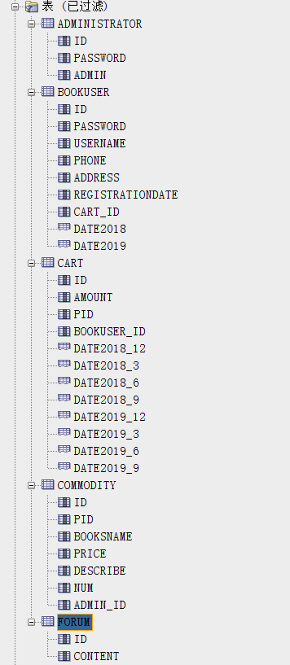

#### 4.创建视图计算每个用户购车中单个商品的总价

``` oracle
create or replace  view view_SinglePriceSum
as 
select b.id,b.username,co.booksname,(co.price*ca.amount) pricesum from COMMODITY co,cart ca,BOOKUSER b where co.pid=ca.pid and ca.BOOKUSER_ID =b.id;
```


#### 5.用户ly_1空间不足，修改ly_1空间大小

``` oracle
ALTER USER ly_1 QUOTA 90M ON space_ly001;
```

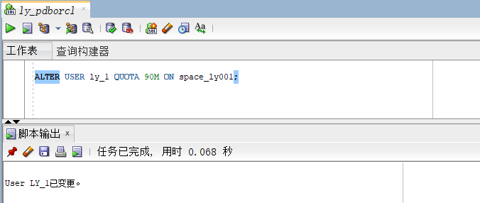

#### 6.插入用户、商品、购物车数据

``` oracle
declare
  id number(38,0);
  username varchar2(50);
  phone varchar2(20);
  address varchar2(30);
  REGISTRATIONDATE date;
  booksname varchar2(50);
  price number(5,2);
  num number(38,0);
  amount number(38,0);
  
begin
  for i in 1..50000
  loop
    if i mod 2 =0 then
      REGISTRATIONDATE:=to_date('2018-5-6','yyyy-mm-dd')+(i mod 60);
    else
      REGISTRATIONDATE:=to_date('2019-5-6','yyyy-mm-dd')+(i mod 60);
    end if;

    --插入用户
    id:=SEQ_ORDER_ID.nextval; --应该将SEQ_ORDER_ID.nextval保存到变量中。
    username := 'aa'|| 'aa';
    username := 'wang' || i;
    phone := '131785693' || i;
	  booksname := '唐诗三百首版本号' || i;
	  address :='成都'|| '四川';
	  price :=(dbms_random.value() * 100);
	  num :=(i mod 5);
    insert into bookuser (id,password,username,phone,address,REGISTRATIONDATE,cart_id)
      values (id,username,username,phone,address,REGISTRATIONDATE,id);
	  --插入货品	
	  insert into commodity(id,pid,booksname,price,describe,num,admin_id)
		  values (id,id,booksname,price,'good',num,1);
	  --插入购物车
	  amount :=(id mod 3 ) + 1;
	  insert into cart(id,amount,pid,bookuser_id)
	 	  values (id,amount,id,id);

    IF I MOD 1000 =0 THEN
      commit; --每次提交会加快插入数据的速度
    END IF;
  end loop;
end;
```

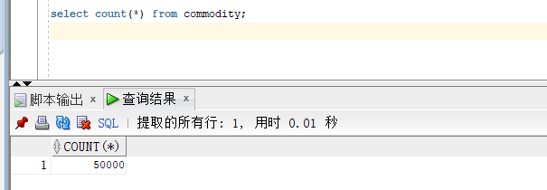

#### 7.创建程序包、存储过程、函数执行分析计划

创建程序包
函数getcartsumprice计算每个用户的购物车商品总金额
存储过程adduser插入用户信息

``` oracle
create or replace PACKAGE book_package Is
   function getcartsumprice(user_id number) return number;
   procedure adduser(password varchar2,username varchar2,phone varchar2,address varchar2,registerdate VARCHAR2);
end book_package;
```

创建函数、存储过程

``` oracle
create or replace PACKAGE body book_package Is
 
       function getcartsumprice(user_id number) return number as
          begin
            declare cart_sum number;
			query_sql varchar2(200);
            begin
			query_sql:='select sum(pricesum) from view_SinglePriceSum where ID=' || user_id;
              execute immediate query_sql into cart_sum;
			  return cart_sum;
            end;
        end getcartsumprice;
                  procedure addUser(password varchar2,username varchar2,phone varchar2,address varchar2,registerdate varchar2) as
            begin
              declare maxId number;
              begin
                select max(id) into maxId from bookuser;
                insert into bookuser values(maxId+1,password,username,phone,address,to_date(registerdate,'yyyy-mm-dd'),maxId+1);
                commit;
              end;
            end adduser;
    end book_package;
```

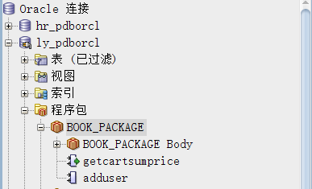
存储过程、函数执行分析
使用自定义函数getcartsumprice（）查询id号为20112的用户购物车商品总价

``` oracle
select BOOK_PACKAGE.getcartsumprice(20112) from dual;
```


使用存储过程adduser插入用户数据

``` oracle
set serveroutput on
declare
begin
BOOK_PACKAGE.addUser('131','cwd','125626','hongkong','2019-05-02');
end;
```

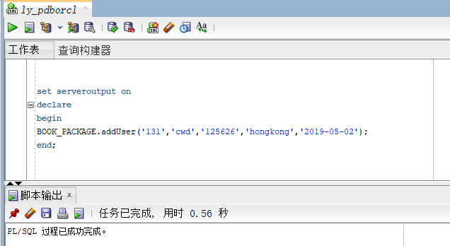
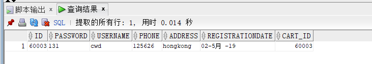
执行计划分析

``` oracle

select * from BOOKUSER b,COMMODITY co,CART ca where b.id=ca.BOOKUSER_ID and ca.PID=co.PID and
b.REGISTRATIONDATE between to_date('2018-1-1','yyyy-mm-dd') and to_date('2018-6-1','yyyy-mm-dd');
```

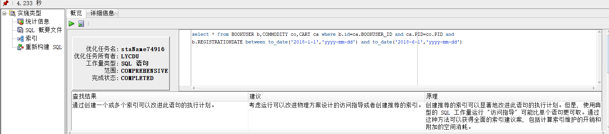
当前用户表空间使用状况

``` oracle
SELECT * from user_users;
```

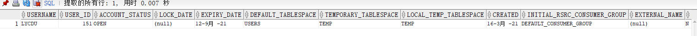

### 采用Rman备份

#### 8.1创建恢复目录

-- 创建恢复目录：用来存储RMAN资料库的
create tablespace bp datafile '/opt/oracle/oradata/bp.dbf' size 20m autoextend on next 5m maxsize unlimited;
-- 在恢复目录数据库中创建RMAN用户并授权
create user c##ly_r identified by 123 default tablespace bp quota unlimited on bp;
grant connect,resource,recovery_catalog_owner to c##ly_r;
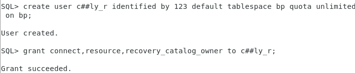

#### 8.2连接RMAN恢复目录数据库

- 连接RMAN恢复目录数据库
rman catalog c##ly_r/123
-- 创建恢复目录
create catalog tablespace bp;
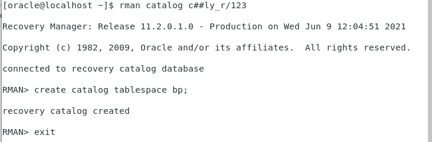
-- 退出
exit
-- 确认环境信息
echo $ORACLE_SID
-- 连接到目标数据库、连接到恢复目录数据库
rman catalog c##ly_r/123 target /
-- 向恢复目录注册数据库ORCL——此时就可以使用RMAN的恢复目录对目标数据库进行备份和恢复操作
register database;
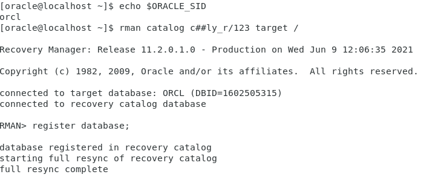

#### 8.3通道分配

-- 手动通道配置
run
{
allocate channel ch1 device type disk;
allocate channel ch2 device type disk;
allocate channel ch3 device type disk;
}
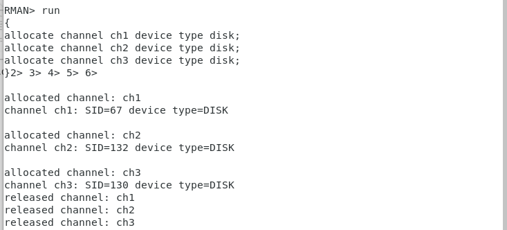

-- 显示已经配置过的有默认值的参数，其中包括通道参数
show all;

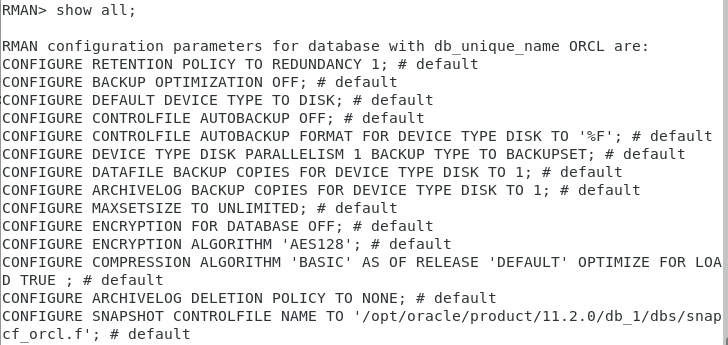

#### 8.4归档模式下备份与恢复

-- 查看数据库是否处于归档模式下
archive log list;
-- 关闭数据库
shutdown immediate
-- 重启并设置成归档模式
startup mount;
alter database archivelog;
archive log list;
alter database open;
-- 连接到目标数据库、连接到恢复目录数据库
rman catalog c##ly_r/123 target /
-- 备份和恢复整个数据库
backup database;
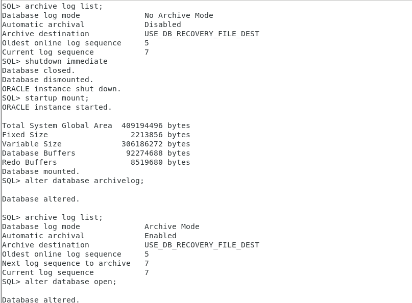
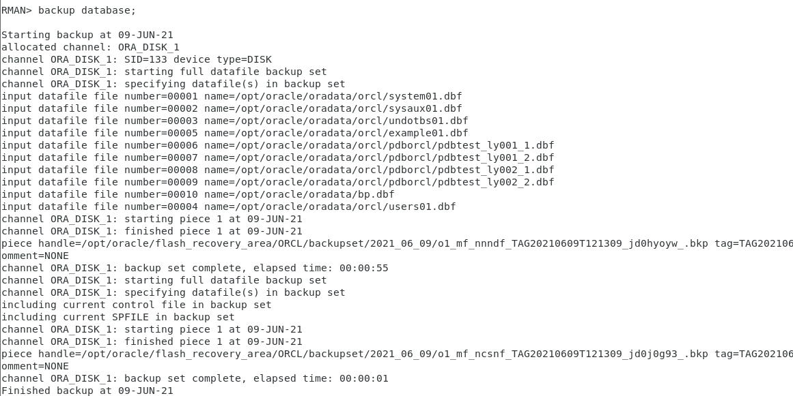

#### 8.5测试备份情况

-- 切换到保存路径
cd /opt/oracle/flash_recovery_area/ORCL/backupset/
-- 查看文件
ls


#### 8.6测试恢复功能

-- 关闭数据库
shutdown immediate;
-- 退出数据库
exit
-- 切换到数据文件存储路径
cd /home/oracle/app/oracle/oradata/orcl/pdborcl
-- 查看数据文件
ls
-- 删除train_data01.dbf
rm -rf train_data01.dbf
-- 再次确认
ls


-- 启动数据库
sqlplus /nolog
conn /as sysdba
startup
select status from v$instance;
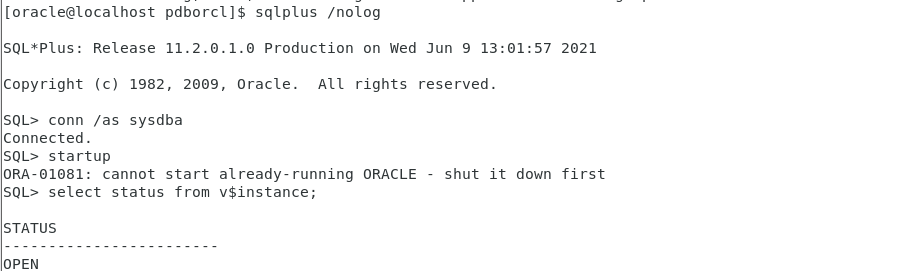
-- 连接RMAN
rman target sys/123
-- 恢复数据库
restore database;
-- 同步恢复
recover database;

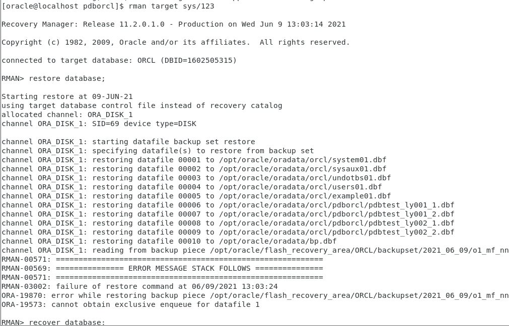

-- 打开数据库
alter database open resetlogs;
-- 再次启动数据库，启动成功，检查此时数据库状态，此时状态已经打开
startup
select status from v$instance;
-- 再次切换到数据文件存储路径
cd /opt/oracle/oradata/orcl/pdborcl
-- 查看数据文件，删除的已经还原
ls


